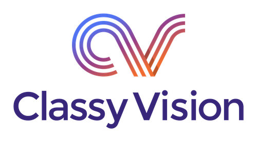

<p align="center"></p>

[](https://github.com/facebookresearch/ClassyVision/blob/master/LICENSE) [](https://circleci.com/gh/facebookresearch/ClassyVision) [](https://github.com/facebookresearch/ClassyVision/blob/master/CONTRIBUTING.md)

--------------------------------------------------------------------------------

[Classy Vision](http://classyvision.ai) is a new end-to-end, PyTorch-based framework for large-scale training of state-of-the-art image and video classification models. Previous computer vision (CV) libraries have been focused on providing components for users to build their own frameworks for their research. While this approach offers flexibility for researchers, in production settings it leads to duplicative efforts, and requires users to migrate research between frameworks and to relearn the minutiae of efficient distributed training and data loading. Our PyTorch-based CV framework offers a better solution for training at scale and for deploying to production. It offers several notable advantages:

* Ease of use. The library features a modular, flexible design that allows anyone to train machine learning models on top of PyTorch using very simple abstractions. The system also has out-of-the-box integration with Amazon Web Services (AWS), facilitating research at scale and making it simple to move between research and production.
* High performance. Researchers can use the framework to train Resnet50 on ImageNet in as little as 15 minutes, for example.
* Demonstrated success in training at scale. We’ve used it to replicate the state-of-the-art results from the paper [Exploring the Limits of Weakly Supervised Pretraining](https://arxiv.org/abs/1805.00932).
* Integration with PyTorch Hub. AI researchers and engineers can download and fine-tune the best publically available ImageNet models with just a few lines of code.
* Elastic training. We have also added experimental integration with [PyTorch Elastic](https://github.com/pytorch/elastic), which allows distributed training jobs to adjust as available resources in the cluster changes. It also makes distributed training robust to transient hardware failures.

Classy Vision is beta software. The project is under active development and our APIs are subject to change in future releases.

## Installation

#### Installation Requirements
Make sure you have an up-to-date installation of PyTorch (1.4), Python (3.6) and torchvision (0.5). If you want to use GPUs, then a CUDA installation (10.1) is also required.

#### Installing the latest stable release
To install Classy Vision via pip:
```bash
pip install classy_vision
```

To install Classy Vision via conda (only works on linux):
```bash
conda install -c conda-forge classy_vision
```

#### Manual install of latest commit on master

Alternatively you can do a manual install.

```bash
git clone https://github.com/facebookresearch/ClassyVision.git
cd ClassyVision
pip install .
```

## Getting started

Classy Vision aims to support a variety of projects to be built and open sourced on top of the core library. We provide utilities for setting up a project in a standard format with some simple generated examples to get started with. To start a new project:

```bash
classy-project my-project
cd my-project
```

We even include a simple, synthetic, training example to show how to use Classy Vision:

```bash
 ./classy_train.py --config configs/template_config.json
 ```

Voila! A few seconds later your first training run using our classification task should be done. Check out the results in the output folder:
```bash
ls output_<timestamp>/checkpoints/
checkpoint.torch model_phase-0_end.torch model_phase-1_end.torch model_phase-2_end.torch model_phase-3_end.torch
```

`checkpoint.torch` is the latest model (in this case, same as `model_phase-3_end.torch`), a checkpoint is saved at the end of each phase.

For more details / tutorials see the documentation section below.

## Documentation

Please see our [tutorials](https://classyvision.ai/tutorials/) to learn how to get started on Classy Vision and customize your training runs. Full documentation is available [here](https://classyvision.ai/api/).

## Join the Classy Vision community
* Website: https://classyvision.ai
* [Stack overflow](https://stackoverflow.com/questions/tagged/classy-vision)
* Slack: [invite link](https://join.slack.com/t/classyvision/shared_invite/enQtODczNTEyOTUyNTY0LTc4YTc3NThhMzhiNGNjZTkzY2RkYjZiNDc1ZDcyZGYxY2Q0M2M5YjAyYjA4OGQ2M2FlNDk4YzBlNWRjOTg3ZTE)

See the [CONTRIBUTING](CONTRIBUTING.md) file for how to help out.

## License
Classy Vision is MIT licensed, as found in the LICENSE file.

## Citing Classy Vision
If you use Classy Vision in your work, please use the following BibTeX entry:

```
@article{adcock2019classy,
  title={Classy Vision},
  author={{Adcock}, A. and {Reis}, V. and {Singh}, M. and {Yan}, Z. and {van der Maaten} L., and {Zhang}, K. and {Motwani}, S. and {Guerin}, J. and {Goyal}, N. and {Misra}, I. and {Gustafson}, L. and {Changhan}, C. and {Goyal}, P.},
  howpublished = {\url{https://github.com/facebookresearch/ClassyVision}},
  year={2019}
}
```
